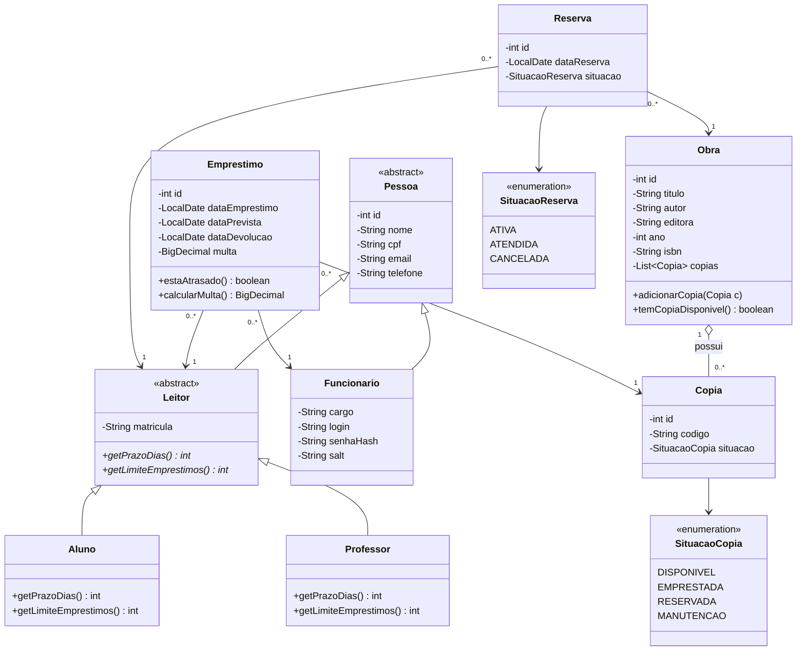

# Diagrama de Classes

```mermaid
classDiagram
    class Pessoa {
        <<abstract>>
        -int id
        -String nome
        -String cpf
        -String email
        -String telefone
    }
    class Leitor {
        <<abstract>>
        -String matricula
        +getPrazoDias()* int
        +getLimiteEmprestimos()* int
    }
    class Aluno {
        +getPrazoDias() int
        +getLimiteEmprestimos() int
    }
    class Professor {
        +getPrazoDias() int
        +getLimiteEmprestimos() int
    }
    class Funcionario {
        -String cargo
        -String login
        -String senhaHash
        -String salt
    }
    class Obra {
        -int id
        -String titulo
        -String autor
        -String editora
        -int ano
        -String isbn
        -List~Copia~ copias
        +adicionarCopia(Copia c)
        +temCopiaDisponivel() boolean
    }
    class Copia {
        -int id
        -String codigo
        -SituacaoCopia situacao
    }
    class SituacaoCopia {
        <<enumeration>>
        DISPONIVEL
        EMPRESTADA
        RESERVADA
        MANUTENCAO
    }
    class Emprestimo {
        -int id
        -LocalDate dataEmprestimo
        -LocalDate dataPrevista
        -LocalDate dataDevolucao
        -BigDecimal multa
        +estaAtrasado() boolean
        +calcularMulta() BigDecimal
    }
    class Reserva {
        -int id
        -LocalDate dataReserva
        -SituacaoReserva situacao
    }
    class SituacaoReserva {
        <<enumeration>>
        ATIVA
        ATENDIDA
        CANCELADA
    }

    Pessoa <|-- Leitor
    Pessoa <|-- Funcionario
    Leitor <|-- Aluno
    Leitor <|-- Professor
    Obra "1" o-- "0..*" Copia : possui
    Copia --> SituacaoCopia
    Reserva --> SituacaoReserva
    Emprestimo "0..*" --> "1" Leitor
    Emprestimo "0..*" --> "1" Copia
    Emprestimo "0..*" --> "1" Funcionario
    Reserva "0..*" --> "1" Leitor
    Reserva "0..*" --> "1" Obra
``` 

